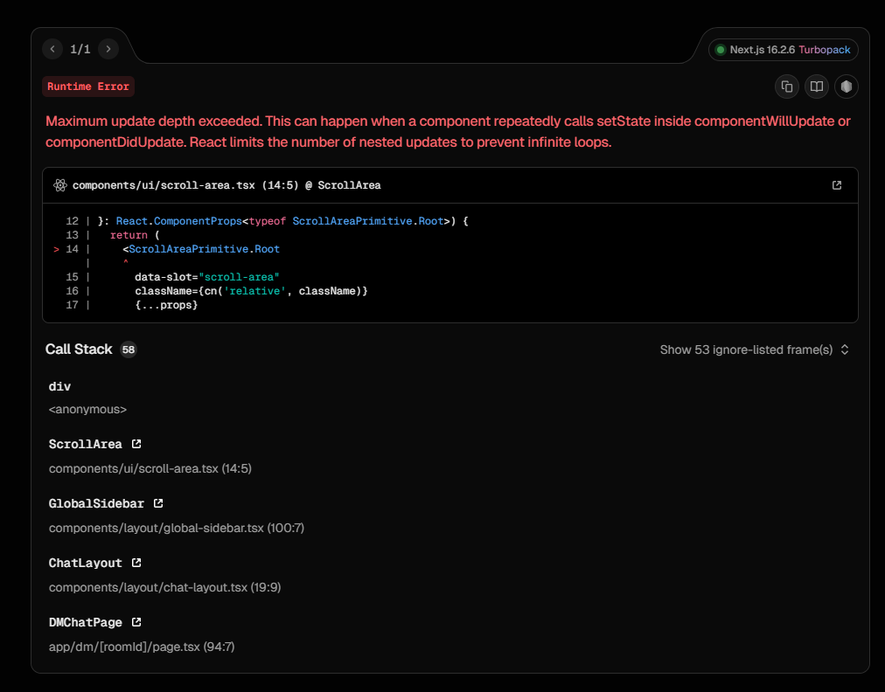

# Notification Toast — Hướng dẫn triển khai và tích hợp

Tài liệu này mô tả chi tiết cơ chế hiển thị toast khi có tin nhắn mới đến từ tài khoản khác trong cùng một club, và cách đảm bảo toast chỉ hiển thị khi user chưa `seen` đoạn chat đó.

Mục tiêu:
- Mô tả luồng dữ liệu, điều kiện hiển thị toast.
- Hướng dẫn tích hợp vào frontend (tương thích với code hiện tại trong repository).
- Gợi ý cải tiến và xử lý edge cases.

---

**File tham khảo trong repo:**
- [contexts/notification-context.tsx](contexts/notification-context.tsx#L1-L1)
- [app/student/chat/page.tsx](app/student/chat/page.tsx#L1-L1)
- [app/club-leader/chat/page.tsx](app/club-leader/chat/page.tsx#L1-L1)
- [app/api/chat/poll/route.ts](app/api/chat/poll/route.ts#L1-L1)

---

## 1. Mô tả hành vi mong muốn

Khi có tin nhắn mới trong một club mà user là thành viên:
- Nếu user KHÔNG ở trang chat (không show component chat) → hiển thị toast tóm tắt tin nhắn mới.
- Nếu user đang ở trang chat nhưng KHÔNG xem room (club) chứa tin nhắn → hiển thị toast.
- Nếu user đang xem chính room đó (đang open và active) → KHÔNG hiển thị toast.

Toast chỉ hiển thị cho tin nhắn do *tài khoản khác* gửi (không thông báo khi chính user gửi tin).
Toast nên tránh lặp lại cùng một message nhiều lần (dùng set để track id đã notify).

---

## 2. Luồng dữ liệu hiện tại (tóm tắt)

1. `NotificationProvider` đọc `uniclub-auth` từ `sessionStorage` để biết `clubIds` của user.
2. Nếu notifications `enabled`, provider sẽ poll `/api/chat/poll` cho từng `clubId` (mỗi 2s) bằng `refreshUnreadCounts()`.
3. `fetchUnreadForClub(clubId)` gọi `/api/chat/poll?clubId&after=lastSeen[clubId]` để lấy tin nhắn mới kể từ `lastSeen`.
4. Lọc tin nhắn do chính user gửi (dựa trên `auth.userId`) => chỉ giữ `unreadMessages`.
5. Nếu thỏa điều kiện hiển thị (không ở trang chat hoặc đang ở trang chat nhưng xem club khác), toast được hiển thị cho tin nhắn mới nhất và `messageId` đó được ghi vào `lastNotifiedMessages` set để tránh thông báo lặp.

Để tránh re-show khi user sau đó mở chat, component chat khi mount sẽ gọi `markClubAsSeen(clubId)` để cập nhật `lastSeen[clubId] = Date.now()`.

---

## 3. Kiến trúc dữ liệu cần có

- `lastSeen: Record<number, number>` — timestamp cuối cùng user đã xem cho mỗi club.
- `lastNotifiedMessages: Set<string>` — danh sách message.id đã show toast.
- `currentViewingClubId: number | null` — clubId mà user đang xem (được set khi vào trang chat và clear khi rời).
- `enabled: boolean` — bật/tắt notification polling.

---

## 4. Điều kiện hiển thị toast (pseudocode)

```
if (!enabled) return
if newMessages.length == 0 return
unreadMessages = newMessages.filter(m => m.userId !== auth.userId)
if unreadMessages.length == 0 return
latest = unreadMessages[unreadMessages.length - 1]
if lastNotifiedMessages.has(latest.id) return
isOnChatPage = pathname?.includes('/chat')
isViewingThisClub = currentViewingClubId === clubId
shouldShow = (!isOnChatPage) || (isOnChatPage && !isViewingThisClub)
if (shouldShow) {
  showToast(title: `New message from ${latest.userName}`, description: truncate(latest.message, 100))
  add latest.id to lastNotifiedMessages
}
```

---

## 5. Hướng dẫn tích hợp vào project hiện tại

1. `NotificationProvider` đã cài đặt hầu hết logic. Để dùng trong project:
   - Bọc app bằng `NotificationProvider` (nơi root provider) để đảm bảo context có sẵn.
   - Gọi `setCurrentViewingClub(clubId)` trong trang chat khi user vào room, và gọi `markClubAsSeen(clubId)` để cập nhật `lastSeen`.

2. Tích hợp toast UI
   - Project hiện tại dùng hook `useToast()` (xem [hooks/use-toast] nếu có). Gọi `toast({ title, description, duration })`.
   - Truncate message dài (<= 100 chars) để toast ngắn gọn.

3. Tránh duplicate
   - `lastNotifiedMessages` đã dùng `Set` local. Nếu muốn đồng bộ giữa device, cần lưu phía server hoặc localStorage.

4. Bật/tắt notification
   - Cung cấp UI để toggle `enabled` trong `NotificationProvider` (toggleNotifications có sẵn).
   - Lưu `enabled` vào `sessionStorage` để giữ trạng thái.

5. Khi user mở chat của 1 club
   - Gọi `markClubAsSeen(clubId)` ngay khi mount trang chat (hoặc khi user focus tab).
   - Gọi `setCurrentViewingClub(clubId)` để ngăn toast hiển thị cho room đó.

---

## 6. Mã tham khảo (extract từ repo)

Đoạn quan trọng đã có trong `NotificationProvider` (đã implement):

- Gọi poll:
```ts
const response = await axios.get('/api/chat/poll', { params: { clubId, after: lastSeenTimestamp } })
const newMessages = response.data.messages || []
const unreadMessages = newMessages.filter(msg => msg.userId !== currentUserId)
// determine shouldShowToast using pathname and currentViewingClubId
```

- Mark as seen:
```ts
function markClubAsSeen(clubId) {
  setLastSeen(prev => ({ ...prev, [clubId]: Date.now() }))
  setUnreadCounts(prev => prev.filter(c => c.clubId !== clubId))
}
```

---

## 7. Edge cases và đề xuất xử lý

1. Thông báo trùng lặp khi message id khác nhưng nội dung giống:
   - Hiện tại track theo `message.id` là đủ.

2. Nhiều device cùng user:
   - Nếu user xem chat trên device A, device B vẫn sẽ poll và có thể show toast. Đề xuất: lưu `lastSeen` trên server cho đồng bộ giữa device.

3. Thời gian delay do polling (2s):
   - Độ trễ yêu cầu thấp; nếu cần realtime thực, chuyển sang WebSocket / SSE.

4. Throttling toasts:
   - Nếu nhiều messages đến cùng lúc, show 1 toast cho latest hoặc gộp thông báo (`3 new messages`).

5. Xử lý tin nhắn cũ sau `lastSeen` bị reset hoặc time skew:
   - Khi set `lastSeen` use server-sourced latestTimestamp thay vì Date.now() (an toàn hơn nếu clock drift).

6. Xác thực & rate limit API polling:
   - Đảm bảo endpoint `/api/chat/poll` có rate-limiting nếu nhiều user poll thường xuyên.

---

## 8. Cải tiến đề xuất (ưu tiên)

- Đồng bộ `lastSeen` lên server khi user điền `markClubAsSeen` (ngoại lệ: hoạt động offline) → cho phép nhiều thiết bị share trạng thái seen.
- Chuyển polling sang WebSocket (socket.io / Upstash Realtime / Pusher) để giảm tần suất request và latency.
- Khi có nhiều messages, show toast dạng tóm tắt: "3 tin nhắn mới từ Club ABC".
- Store `lastNotifiedMessages` vào `sessionStorage` để tồn tại qua reload tab.

---

## 9. Kiểm thử (manual checklist)

- [ ] Khi user ở ngoài trang chat, nhận tin nhắn mới từ user khác -> toast hiện.
- [ ] Khi user ở trang chat nhưng xem club khác -> toast hiện.
- [ ] Khi user đang xem club hiện tại -> KHÔNG hiện toast.
- [ ] Sau khi mở room, gọi `markClubAsSeen` -> toast cho message trước đó không hiển thị lần nữa.
- [ ] Khi user chính gửi tin nhắn -> KHÔNG hiện toast.
- [ ] Reload trang -> `lastSeen` và `lastNotifiedMessages` vẫn hoạt động như mong đợi.

---

## 10. File & hàm cần xem/điều chỉnh nếu muốn mở rộng

- [contexts/notification-context.tsx](contexts/notification-context.tsx#L1-L1) — core logic, chỉnh `POLL_INTERVAL` để test.
- [app/api/chat/poll/route.ts](app/api/chat/poll/route.ts#L1-L1) — nên trả kèm `latestTimestamp` từ redis để `lastSeen` có thể cập nhật theo server.
- [app/student/chat/page.tsx](app/student/chat/page.tsx#L1-L1) — gọi `setCurrentViewingClub` và `markClubAsSeen` khi mount.

---

Nếu bạn muốn, tôi có thể tiếp tục và:
- 1) Thêm ví dụ code để lưu `lastSeen` lên server (API + server handler + client call).
- 2) Triển khai persist `lastNotifiedMessages` vào `sessionStorage`.
- 3) Thay poll thành SSE/WebSocket prototype.

Hãy cho biết bạn muốn tiếp tục với lựa chọn nào (ví dụ: "persist lastSeen to server", "persist lastNotifiedMessages", "SSE prototype").